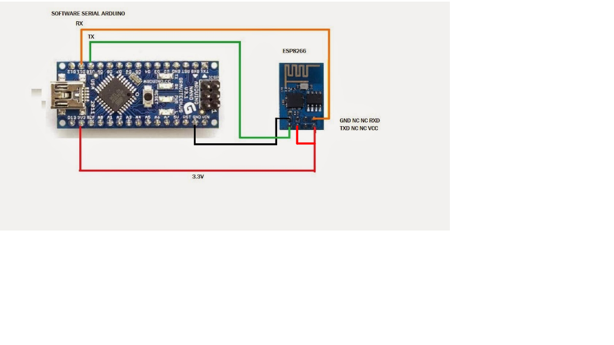

# Flash firmware

First of all, download the firmware from `https://www.espressif.com/en/support/download/at` and the esptool from `https://github.com/espressif/esptool`.

Then, put the following files into the esptool root folder:

- boot_v1.7.bin
- user1.2048.new.5.bin
- blank.bin
- esp_init_data_default_v08.bin

Then, connect the ESP8266-01 to the Arduino Uno following this tutorial `https://cordobo.com/2300-flash-esp8266-01-with-arduino-uno/`. 

Once this is done, execute the following commands:

`esptool.py --port /dev/cu.usbmodem14101 --baud 115200 erase_flash`

`esptool.py --port /dev/cu.usbmodem14101 --baud 115200 write_flash --flash_size 2MB-c1 0x00000 boot_v1.7.bin 0x01000 user1.2048.new.5.bin 0x1fb000 blank.bin 0x1fc000 esp_init_data_default_v08.bin 0xfe000 blank.bin 0x1fe000 blank.bin --verify`

Then connect the ESP8266 to the Arduino Nano 33 BLE using the following wiring

To check if the firmware works correctly use the file `WiFi.ino` with the command `AT` or `AT+GMR`.